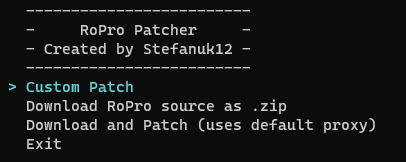

# RoPro Patcher
This automatically patches the [RoPro](https://chrome.google.com/webstore/detail/ropro-enhance-your-roblox/adbacgifemdbhdkfppmeilbgppmhaobf?hl=en-GB) extension for you, allowing you to have `pro_tier` for free.

This is **not** a stealer of any sort. You can view all of the code on here and see that it is safe. If you have any issues / features not working, please look at the [note](#note)

## Links

1. ~~[Video tutorial (v1.1.4 and below)](https://www.youtube.com/watch?v=Do1X2COTq_8)~~ Striked down
2. [Video tutorial (v2.0.0 and above)](https://cdn.discordapp.com/attachments/1131228889113432166/1131230523390439424/Sequence_01.mp4)
3. [V3rmillion thread](https://v3rmillion.net/showthread.php?tid=1197674)

## NOTE

If you have any issues / feautres not working, please visit the current open issues [here](https://github.com/Stefanuk12/RoProPatcher/issues).

## Documentation

You can view all of the documentation [here](./docs/), make sure to read any [notices above](#note) too.

1. [Automatic download](./docs/auto_download.md)
2. [Manual download](./docs/manual_download.md)
3. [Installing](./docs/installing.md)
4. [Verification token](./docs/verification_token.md)
